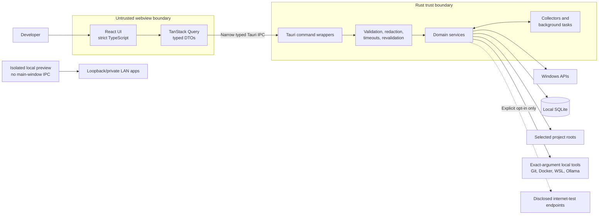

# Mr Manager

[](https://github.com/Xuanming-Guo/Mr-Manager/actions/workflows/ci.yml)
[](https://github.com/Xuanming-Guo/Mr-Manager/actions/workflows/codeql.yml)
[](LICENSE)


Mr Manager is a local-first Windows command center for developers. It connects projects, processes, ports, localhost services, Docker, local tools, system resources, and network activity in one evidence-based desktop application.

It is built with Tauri 2, Rust, React, and strict TypeScript. It works without an account, cloud backend, API key, telemetry, or mandatory internet connection, and a clean launch makes no external network requests.

> [!IMPORTANT]
> Mr Manager is pre-release source software. There is no signed installer or trusted public binary yet. Build it locally and expect Windows to warn about unsigned executables.

## Why it exists

Local development state is usually scattered across Task Manager, terminals, `netstat`, Docker Desktop, project folders, package manifests, and browser tabs. That makes simple questions unnecessarily difficult:

- Which process owns this port?
- Which project started this local service?
- Is Docker unavailable, still starting, or permission-limited?
- Is a slowdown CPU, memory, disk, GPU, Docker, VPN, or network related?
- Can another device reach this localhost application?
- Which generated caches are safe to quarantine and restore?

Mr Manager joins real local evidence to answer those questions without inventing relationships or uploading machine data.

## What works today

- Live CPU, memory, disk, process, port, battery-availability, and network evidence.
- Process identity based on PID plus start time, with protected fields shown as unavailable.
- Project registration and bounded discovery for Node, Python, Rust, mixed monorepos, Git, Compose files, manifests, scripts, and environment-key metadata.
- Automatic topology across projects, managed runs, processes, ports, and local URLs, with evidence and confidence on every edge.
- Allowlisted project command execution with bounded redacted logs and Windows Job Object supervision.
- Docker and Compose inventory, diagnostics, logs, lifecycle confirmation, visualisation, and deterministic Compose Doctor checks.
- Local tool detection for Git, VS Code, Docker, Ollama, WSL, language toolchains, databases, and common VPN clients.
- Adapter throughput, session totals, LAN links, VPN evidence, localhost binding warnings, and explicitly opt-in internet diagnostics.
- System Diagnostics recordings with CPU/RAM timelines, annotations, ranked processes, and deterministic change analysis.
- Cleaner review plans with reversible quarantine, restore support, revalidation, and separate irreversible purge confirmation.

Unavailable evidence is labelled as unavailable, unsupported, partial, or permission-limited. Mr Manager does not fabricate metrics, per-process network usage, reachability, or success states.

## Architecture



Rust owns all operating-system, filesystem, process, network, Docker, database, and subprocess access. The frontend receives narrow typed data only. Local preview windows do not inherit the main window's privileged commands.

## Requirements

- Windows 11.
- [Node.js 22](https://nodejs.org/) and npm 10 or newer.
- Rust 1.88; the included toolchain file installs the required formatter and linter components.
- Microsoft C++ Build Tools and WebView2 from the [Tauri Windows prerequisites](https://v2.tauri.app/start/prerequisites/).
- Optional local tools such as Docker Desktop, Git, WSL, or Ollama for their corresponding integrations.

Administrator access is not required for normal operation. Windows may withhold protected process or ownership information from a standard-user application; Mr Manager reports that limitation instead of elevating itself.

## Quick start

```powershell
git clone https://github.com/Xuanming-Guo/Mr-Manager.git
cd Mr-Manager
npm ci
npm run app
```

After dependencies are installed, `npm run app` is the one command needed to build and launch the desktop development application.

The web-only preview is available through `npm run dev`, but it intentionally cannot access real system data or Tauri IPC.

## Build and open the executable

Build a raw unsigned executable without creating an installer:

```powershell
npm run app:build
```

The result is written to `src-tauri\target\release\mr-manager.exe`. Open the most recent release build, falling back to a debug build, with:

```powershell
npm run app:open
```

The executable is intentionally ignored by Git. Do not redistribute it as a signed or trusted release.

## First use

1. Open **Settings** and choose Normal or Fast refresh.
2. Add only the project roots you want Mr Manager to inspect.
3. Use **Projects** and **Topology** to connect manifests, managed runs, processes, ports, and local URLs.
4. Open **Docker**, **Integrations**, **Network**, or **System Diagnostics** for local evidence. Optional internet diagnostics remain disabled until explicitly enabled and started.
5. Review Cleaner candidates carefully. Quarantine is reversible; permanent purge is a separate confirmation.

Long-running in-app tasks continue when you navigate to another section, but they do not survive a full application exit.

## Privacy and safety

- No account, analytics, telemetry, cloud backend, AI service, or clean-launch internet request.
- Project scanning is bounded to roots selected by the user and does not recursively scan entire drives by default.
- Raw environment values and secrets are not stored or displayed; only safe metadata such as key names is collected.
- Internet diagnostics are disabled by default, show the endpoint and expected effect, and label contacted-internet results.
- Mutations show their exact target and effect and are revalidated immediately before execution.
- Cleaner quarantines first and never purges automatically.
- Exports redact sensitive network and machine information by default.

## Verification

Run the standard source checks with:

```powershell
npm run repo:check
npm run branch:check
npm run format:check
npm run lint
npm run typecheck
npm run test:run
npm run build
npm run test:e2e
cargo fmt --manifest-path src-tauri/Cargo.toml --all -- --check
cargo clippy --manifest-path src-tauri/Cargo.toml --all-targets --all-features -- -D warnings
cargo test --manifest-path src-tauri/Cargo.toml --all-features
npm run tauri build -- --debug --no-bundle
```

Destructive tests must use temporary synthetic fixtures only.

## Repository layout

| Path         | Purpose                                                                                |
| ------------ | -------------------------------------------------------------------------------------- |
| `src/`       | React application, typed IPC clients, routes, and frontend tests                       |
| `src-tauri/` | Rust domains, Windows providers, database migrations, commands, and Tauri capabilities |
| `fixtures/`  | Synthetic project fixtures used by scanners and tests                                  |
| `e2e/`       | Browser smoke tests and clean-launch egress assertions                                 |
| `.github/`   | CI, security analysis, dependency updates, and issue forms                             |
| `scripts/`   | Repository-policy and local executable helpers                                         |

## Troubleshooting

| Problem                                                       | What to do                                                                                                                                 |
| ------------------------------------------------------------- | ------------------------------------------------------------------------------------------------------------------------------------------ |
| `npm run app` reports missing MSVC, WebView2, or linker tools | Install every Tauri Windows prerequisite, restart the terminal, and retry.                                                                 |
| Node reports an unsupported engine                            | Install or select Node 22 (the required major is recorded in `.nvmrc`) and run `npm ci` again.                                             |
| Port 1420 is already in use                                   | Stop the previous Vite/Tauri development process before launching another.                                                                 |
| The browser preview says system data is unavailable           | This is expected. Use `npm run app`; a normal browser has no privileged Tauri IPC.                                                         |
| Docker times out or reports a partial inventory               | Start Docker Desktop fully, wait for its engine to become ready, then refresh Docker. Protected or remote contexts may remain unavailable. |
| Docker, Network, or Integrations still flash terminals        | Rebuild and run the current executable; an older binary may predate the shared hidden-process policy.                                      |
| Some process paths, owners, or commands are missing           | Windows protects some processes from standard-user inspection. Mr Manager does not guess or silently elevate.                              |
| `npm run test:e2e` cannot find Chromium                       | Run `npx.cmd playwright install chromium` from PowerShell, then retry. Using `npx.cmd` avoids systems that block the `npx.ps1` shim.       |
| Windows blocks `mr-manager.exe`                               | The local build is unsigned. Review the source and build it locally; no trusted release is currently published.                            |
| `npm run app:open` cannot find an executable                  | Run `npm run app:build` first.                                                                                                             |
| PowerShell or application-control policy blocks a command     | Use an approved development environment or ask the machine administrator; do not disable security controls silently.                       |

## Contributing and security

Read [CONTRIBUTING.md](CONTRIBUTING.md) and [CODE_OF_CONDUCT.md](CODE_OF_CONDUCT.md) before opening a pull request. Report vulnerabilities privately according to [SECURITY.md](SECURITY.md), never in a public issue.

## License

Mr Manager is licensed under the [Apache License 2.0](LICENSE).
